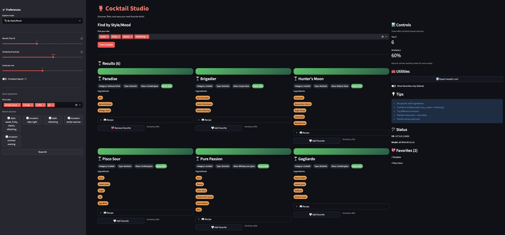
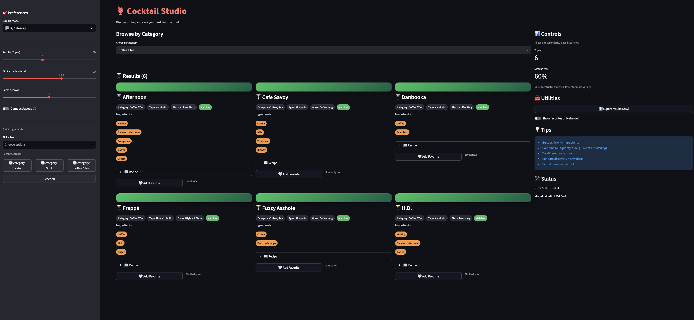

# 🍹 Cocktail Recommendation

This project will suggest your favorite cocktails by turning your preferences (e.g. "sweet, tropical, fruity") into embeddings, finds the closest matching drinks through pgvector PostgreSQL database, and returns full recipes

## ✨ Features
- Vector search with pgvector
- Embeddings via SentenceTransformers (default: `all-MiniLM-L6-V2`)
- Multiple discovery modes: by name, ingredients, style/mood, occasion, category, mixed filters, and random

## ✅ Prerequisites
- Python 3.11
- PostgreSQL with pgvector extension
- Docker & Docker Compose
- uv (optional, if run locally)

## 🚀 Quickstart
### Option 1 - Docker (recommended)
1. Create `.env` in repo root:
```env
DB_HOST=localhost
DB_PORT=5433
DB_USER=postgres
DB_PASSWORD=your_password
DB_NAME=cocktails_db
MODEL_NAME=all-MiniLM-L6-v2
```

2. Database Setup:
```bash
make run-docker
```

Open: `http://localhost:8501` 

### Option 2 - Local
You need to make sure you have `uv`
1. Install dependencies:
```bash
uv sync
# or:
uv pip install -r requirements.txt
```

2. Create `.env` in repo root:
```env
DB_HOST=localhost
DB_PORT=5433
DB_USER=postgres
DB_PASSWORD=your_password
DB_NAME=cocktails_db
MODEL_NAME=all-MiniLM-L6-v2
``` 

3. 
```bash
uv run src/quick_start.py
make run-local
```

## 🎬 Demo
### 1. Style/Mood Mode


### 2. Category Mode
